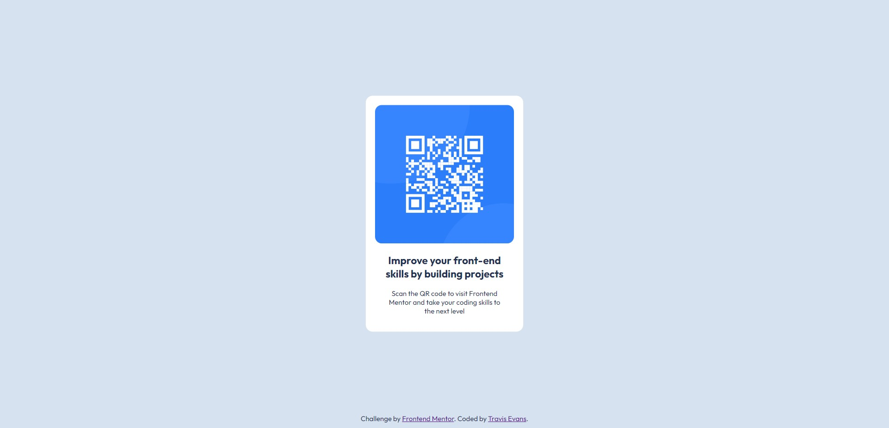

# Frontend Mentor - QR code component solution

This is a solution to the [QR code component challenge on Frontend Mentor](https://www.frontendmentor.io/challenges/qr-code-component-iux_sIO_H). Frontend Mentor challenges help you improve your coding skills by building realistic projects.

## Table of contents

-   [Overview](#overview)
    -   [Screenshot](#screenshot)
-   [My process](#my-process)
    -   [Built with](#built-with)
    -   [What I learned](#what-i-learned)

## Overview

A simple CSS qr code card.

### Screenshot



## My process

### Built with

-   HTML
-   CSS

### What I learned

I learned a couple of useful CSS properties to accomplish the shown effect. This was mainly a warmup activity to get me back into coding:

```css
.center {
    position: absolute;
    top: 50%;
    left: 50%;
    transform: translate(-50%, -50%);
}
```

## Author

-   Website - [Travis Evans](https://www.travisevans.me)
-   Frontend Mentor - [@larquist](https://www.frontendmentor.io/profile/Larquist)
